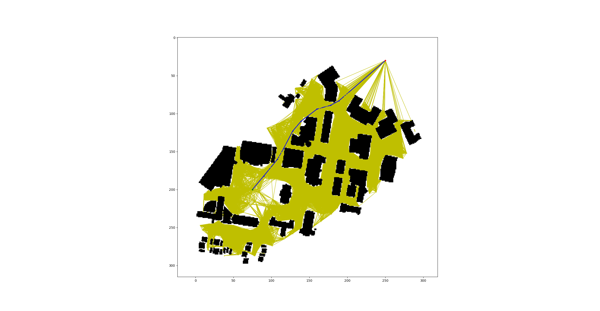

# RBE 550 Standar Search Algorithms Implementation Homework

## Running the project
This code is run and written in python 3.8

The required packages to run are as follows : matplotlib, numpy, networkx, skimage, Pillow, and scipy.

Line 19 of main.py was modified to use LANCZOS model as the previous code there was outdated with my version.

## PRM Implementation
### Functions
The following are function descriptions and a brief overview of what they do internally
#### check_collision
check_collison takes in two indices for points to check a collison between, then gets those points and creates a line between the two using ski.draw.line as it is the most efficient algorithm I could find to generate a line. This line generation returns an ndarray of int which are the indices in self.map_array to check for an obstacle. If none are an obstacle, there is no collision.

#### dis
dis takes in two indices for points to find the euclidian distance between, and returns the euclidian distance after quick maths

#### uniform_sample
Generates n_points across the map in a uniformly distributed fashion. This function uses the map traits to properly distribute points evenly along x and y to allow for a fully uniformly distributed map. Only saves locations that are not obstacles.

#### random_sample
Uses random uniform distribution to sample a map to generate n_points to check, and saves all non obstacle locations to the sample.

#### gaussian_sample
As I didn't want to waste much time selecting two random locations, this uses an obstacle cell array and randomly picks a cell to select as q_1, and then using gaussian distribution centered at q_1 with a radius of exploration of a percentage of the map width and a percentage of the map height (self.gaussian_search) it finds another cell to check if it is not an obstacle. If q_2 is not an obstacle, it saves q_2 to the sample. This is still a gaussian sampler, just modified to be more efficient in its search.

#### bridge_sample
Similar to gaussian sampler, we sample a q_1 that is in collision using obstacle_cells, and then sample another point using gaussian distribution following the same format as the gaussian sample. In this case, if q_2 is an obstacle, we take the midpoint between q_1 and q_2, check if it is an obstacle, and if it is not, we save it to the sample. This code can definitely be more efficient, but I can't be bothered to optimize the code, and it works great.

#### draw_map
Unmodified with base version, draws the map using networkx and matplotlib.

#### sample
Selects a sampling method and samples the map. Then uses a KDTree to find nearest neighbors within a percentile range of the map width defined as self.neighborhood_search to allow for pairs to be generated across the map. Then, it goes through each of these pairs and checks if there is a collision, if there is none, it adds the weighted edge to the graph.

#### search
Using the generated graph from sample, we add the start and goal nodes to the graph. We initially only check within a certain neighborhood for any nodes reachable to the start and goal, but if none are found the KDTree's search radius is increased to force a connection to be achieved to allow the algorithm to solve for a path.

Then, using the graph with updated edges to include edges to the start and goal nodes, it uses dijkstra's algorithm to find the best path.

## PRM Sampling advantages
### Uniform Sampling
Great if we aren't worried about having too many objects in the environment that get in the way of creating a connected path across the map. Quick, easy, and great to visualize.

### Random Sampling
Random is the best option if we want a quick and dirty solution to distributing points across the map to create a connected graph. It can still run into problems when more obstacles are introduced, and would still struggle with complex graphing such as having a thin long hallway which could randomly get a sample within it, or we could just end up having the sampling method never be able to full connect the graph.

### Gaussian Sampling
Obstacle centered, great if we want completeness, but runs into problems if we want to explore the unknown, or explore an area which has no obstacles around it, as no nodes to be able to explore to will be generated in the first place.

### Bridge Sampling
Great for handling complex environments and mapping through a maze, but again like gaussian sampling, stick the robot in an empty field and it won't know what to do. Both gaussian and uniform struggled to create a proper connection to the goal node without increasing the search radius variable as there were simply no nodes within the neighborhood of where we wanted to go.

## Results and Explanation
The following results were taken with varying sizes of KDTree radius pairing
### Uniform Sampling
Reaches the goal, and with the number of samples used, creates a path length that is able to compete

Modification of KDTree's radius doesn't have too much of an effect as long as a node can still make a pair with a direct neighbor.

Uniform Distribution 10% width of map

Uniform Distribution 5% width of map

### Random Sampling
Reaches the goal in both instances, but you can see it struggling to make its way down thin hallways as previously described. Still reaches goal

Random Distribution 10% width of map

Random Distribution 5% width of map

### Gaussian Sampling
Does a great job at creating travelable edges surrounding obstacles, but as considered above, the goal node being so far out from any obstacles could easily cause problems of allowing a connection with the KD tree. This could be solved in the code with an increasing radius for pairing the KDTree, but I chose not to modify the code I wrote to show the concern of a zone being devoid of objects but still needing to travel to the area.

Gaussian Distribution 10% width of map

Gaussian Distribution 5% width of map

### Bridge Sampling
The best at handling hallways, thin locations, and every hard to reach nook and cranny of the map, but is unable to explore and graph a node to free space whatsoever. As stated above, modifications could have been made to pairing the goal node with a higher radius, but I felt it was important to keep to show that bridge sampling does great at handling complex environments, but when it comes to areas with no obstacles, it struggles to create nodes to allow for exploration or connection.

Bridge Distribution 10% width of map

Bridge Distribution 5% width of map
